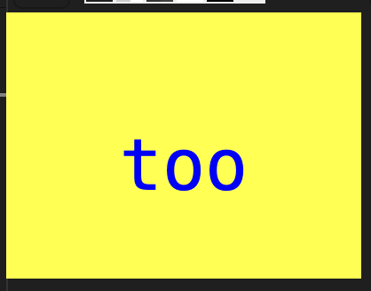
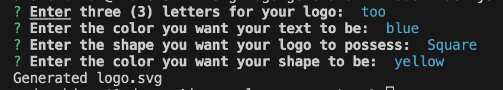

# SVG-Logo-Generator

## Building a SVG Logo Generator

The purpose of this project is to create a logo in .svg format. The logo is composed of a basic shape, maximum of 3 letters, and the choice of shape and text color. Developing this project demonstrates our object oriented programming with server-side development.
This project was developed with Inquirer version 8.2.4. Using Inquirer assisted in forming and structuring of our questions and responses. Along Inquirer, Jest version 29.7.0 is used for testing. 

The following is an image of a newly generated logo.svg file application.

The Following image are the list of questions the application used to create the readme file.

## Installation

N/A

## Usage

To view the application in action, simply click the following link: https://drive.google.com/file/d/1t9bPOVQiuZMAbsmTnVis25f9a2nEpl6s/view?usp=drive_link
The link will redirect you to a video demonstration of the application in action. The SVG-Logo-Generator application functionality generates specific questions to define the shape, the letters, and colors of the user's logo. 

## Credits

N/A

## License

Please refer to the LICENSE in the repo.